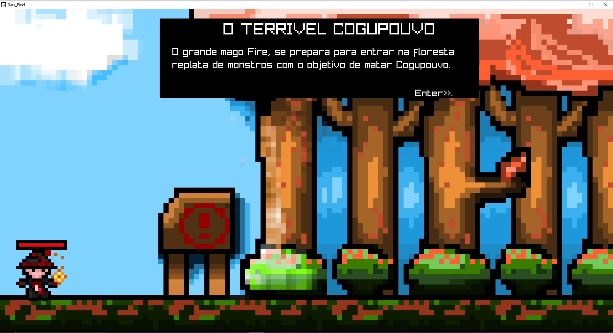
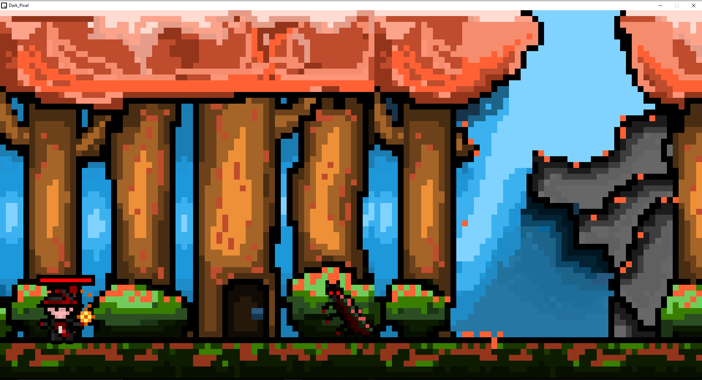
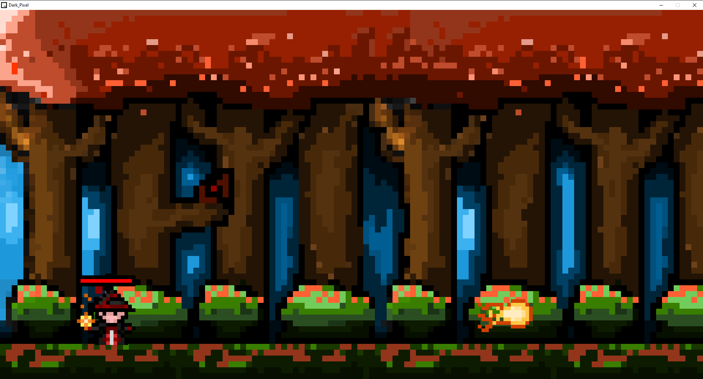
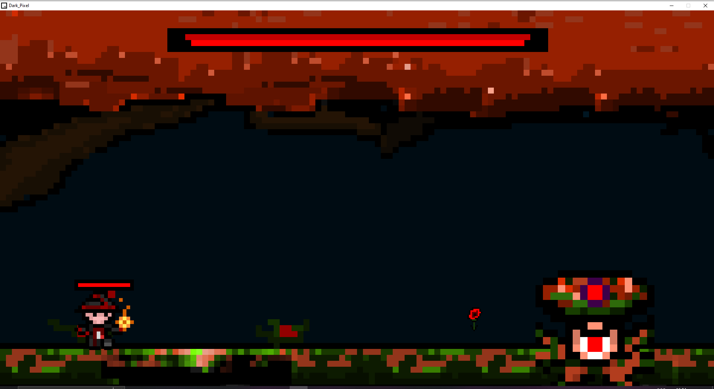
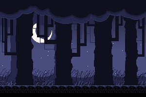

# DARK PIXEL

<h4 align="center">
 🚧  Status: Finished🚀  🚧
</h4>

## ABOUT THIS GAME ?

This is a 2D game made in C language using the raylib library.

## Music, sleep effect, art?

I (Lucas Pontes) made all music, sound effects, art.

## I used the tools: ?

- [raylib](https://www.raylib.com/) for make game.
- [Piskel](https://www.piskelapp.com/) for creating the art.
- [BeepBox](https://www.beepbox.co/) for creating the sound effects

### Features

- [x] Enemies
- [x] Damage
- [x] Life
- [x] Death
- [x] Fireball(lol)
- [x] Boss

## Some screenshots from the game ?











## Compile under Linux

https://github.com/raysan5/raylib/wiki/Working-on-GNU-Linux

```shell
cd Codigo_do_jogo
gcc darkpixel.c -lraylib -lGL -lm -lpthread -ldl -lrt -lX11 -o darkpixel
```

### Create appimage

```shell
linuxdeploy-x86_64.AppImage --appdir AppDir/ --output appimage -d appimage/darkpixel.desktop -i appimage/icon.png -e Codigo_do_jogo/darkpixel
```
